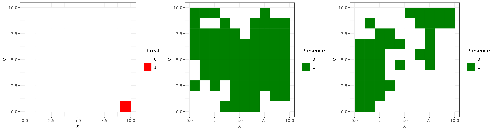
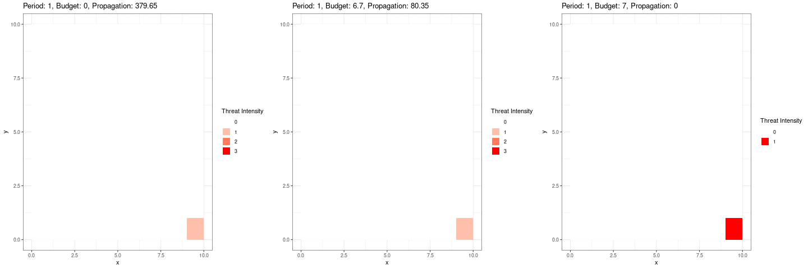

```{r setup, include=FALSE}
knitr::opts_chunk$set(echo = TRUE)
```

# dynamicsthR: Dynamic Conservation Action Planning with Mathematical Programming

## Overview

The `dynamicsthR` package is a powerful tool designed for deterministic dynamic mathematical modeling, specifically tailored for guiding conservation action planning. By utilizing integer programming models, this package simulates various threats, aiding decision-makers in determining optimal conservation actions, their locations, and timing.

## Overview

Ensure you have the "remotes" package installed. If not, install it using the following command:

``` r
if (!require(remotes)) install.packages("remotes")
remotes::install_github("josesalgr/dynamicsthR")

library(dynamicsthR)
```

## Usage

The package follows a clear three-step process:

1)  **`instance()`**: Create an instance for simulation or from a file. This function generates an instance for simulation or reads from a file to create an object with various components. It return a list representing the instance with various components.
    -   **`type`**: A character specifying the type of instance. Use "simulation" for simulation data or "file" for reading from a file.

    -   **`file`**: If type is "file," the path to the file containing the instance data. The instance file has specific structure, please see the examples in the folder "inst".
    -   **`n`**: An integer specifying the number of units (number of rows/columns in a grid).
    -   **`species`**: An integer specifying the number of species. All species will be simulated.
    -   **`threats`**: An integer specifying the number of threats. If `threats_lloc` is `NULL`. The distribution will be simulated.
    -   **`expansionType`**: A matrix specifying the expansion type. The matrix contain threats as rows and three columns, the values indicate he velocity of propagation. Column 1 = Radial Propagation, Column 2 = Downstream Propagation, and Column 3 = Upstream Propagation. Threats can propagate in more than one direction simultaneously.
    -   **`threats_lloc`**: A matrix specifying threat locations.
    -   **`dlong`**: A matrix specifying Downstream Distances.
    -   **`seed`**: An integer specifying the seed for reproducibility.

Example:

```{r, echo=FALSE}
data <- dynamicsthR::instance(type = "simulation")
```

2. **`model()`**: Create a dynamic model based on input parameters. This function takes input parameters and uses them to create a dynamic model. The model is designed for dynamic actions, and the input should be a list containing various components. It return a mathematical model based on the input parameters.
    -   **`input`**: A list containing inputs generated by the **`instance()`** function.
    -   **`objective`**: A string specifying the type of objective to achieve in the mathematical model. There are two options: "min_prop" (by default) and "max_relative_benefit". 
    -   **`levels`**: An integer specifying the number of levels of threats intensities in the model.
    -   **`periods`**: An integer specifying the number of planning periods.
    -   **`budget`**: A numeric scalar specifying the budget per period.

Example:

```{r, echo=FALSE}
m <- dynamicsthR::model(
  input = data,
  levels = 3,
  periods = 5,
  budget = 100000
)
```

3.  **`solve()`**: Solve a mathematical optimization problem using specified solver. This function takes an optimization problem represented by a list of matrices and vectors and solves it using either the CBC (install using the package `Rcbc`) or Gurobi solver. Return a list containing the solution to the optimization problem, including variable values and solver statistics
    -   **`a`**: A list containing information about the optimization problem, including coefficients, constraints, and other parameters.
    -   **`solver`**: A character specifying the solver to be used ("gurobi" or "cbc").
    -   **`cores`**: An integer specifying the number of processor cores to be used.
    -   **`verbose`**: A logical value indicating whether to print solver output.
    -   **`gap_limit`**: A numeric scalar specifying the relative MIP (Mixed-Integer Programming) optimality gap as a stopping condition.

Example:

```{r, echo=FALSE}
solution <- dynamicsthR:solve(model = m, solver = "gurobi")

```

## **Additional Functions**

You can use the following functions to obtain additional information:

-   **`getActions(solution)`**: Retrieve information about conservation actions.

-   **`getPropagation(solution)`**: Obtain details about the propagation of threats.

These functions can be valuable for further analysis and decision-making based on the results of your dynamic conservation model.

## **Example of use**

To showcase the capabilities of the `dynamicsthR` package, we present a simulated example. In this scenario, we begin by defining an expansion type matrix (`expType`) with a single non-zero element representing a specific place where the threat appear. We then use the `instance()` function to generate simulated inputs for a dynamic conservation model. These inputs include specifications for one threat, a 10 x 10 grid of units (100 in total), and two species, both responsive to the threat. With predefined threat locations and the previously defined expansion type (see the Figure below). Subsequently, we create a dynamic model (`m1`) using the `model()` function, specifying the desired maximum levels of intensity of the threat, number of planning periods, and an annual budget. Finally, we employ the `solve()` function to solve the optimization problem and obtain the solution (`sol`). This example provides a starting point for understanding the workflow of the `dynamicsthR` package, from input generation to solving dynamic conservation planning problems. Feel free to modify the parameters and inputs.

```{r, echo=FALSE}
library(dynamicsthR)

expType <- matrix(0, nrow = 1, ncol = 3)
expType[1] <- 1

thr_lloc <- rep(0, 100)
thr_lloc[10] <- 1

inputs <- dynamicsthR::instance(type = "simulation", threats = 1, n = 10, species = 2, threats_lloc = thr_lloc,
	  expansionType = expType)

```



In the initial scenario, we employed an expansion type characterized solely as radial, featuring a velocity of 1 (representing the distance between centroids of the grid). Additionally, we assumed propagation between adjacent units. To discern the distinctions between proposed management strategies, we adjusted the budget accordingly. In blue, the actions are highlighted, while the threat levels are depicted in red. The propagation is determined by the sum of the costs of unaddressed threats.

```{r, echo=FALSE}
m1 <- model(input = inputs, levels = 4L, periods = 10L, budget = 6)
sol <- dynamicsthR::solve(m1, solver = "gurobi")

actions <- dynamicsthR::getActions(sol)
prop <- dynamicsthR::getPropagation(sol)
```
We obtain:




In the following scenario, we introduce an increased propagation velocity (of 2 units of distance), and we observe that higher budget values are required to contain or eliminate the threat.


While these are demonstrative examples, the problem becomes more intricate when considering additional species or other planning objectives.

## **License**

This project is licensed under the [MIT License](https://chat.openai.com/c/LICENSE.md).
